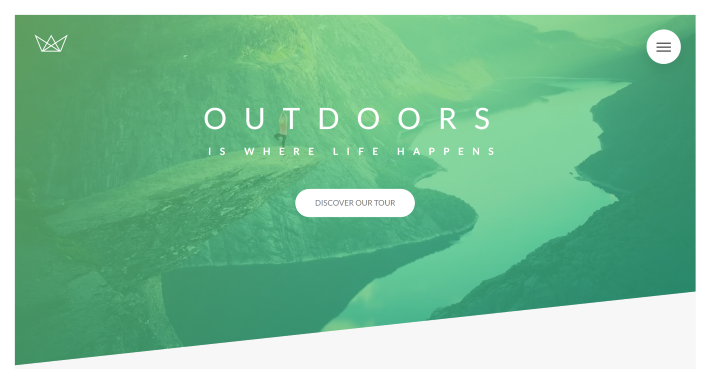
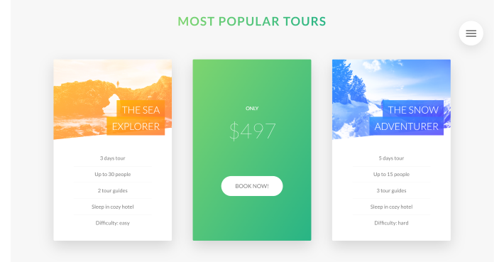
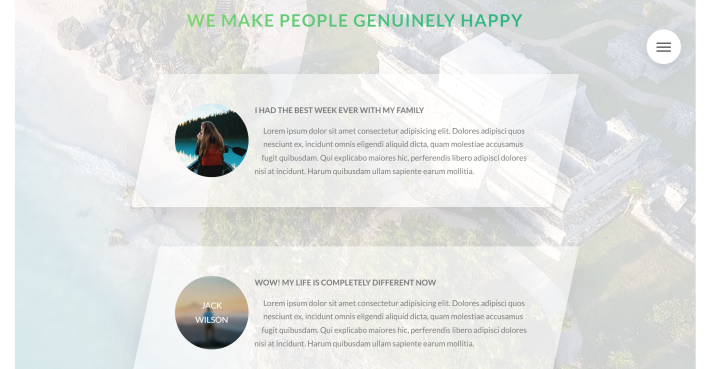
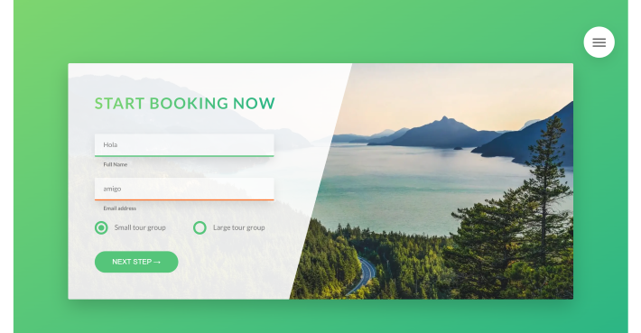
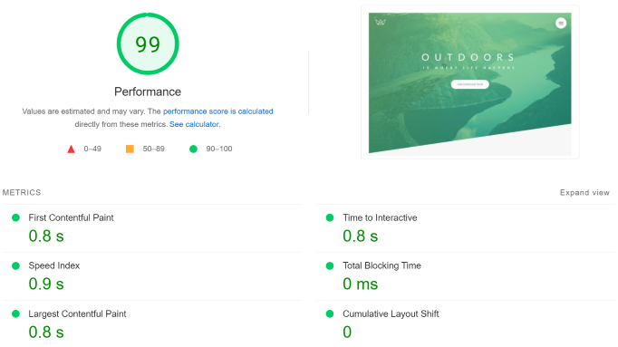

# Natours

A landing page for a fictional travel company Natours. Developed and deployed with enhanced Performance, SEO and Accessibility.

[View Live Site](https://natours-benz.netlify.app/)

## Preview

&nbsp;
&nbsp;

## Features

- UX/UI design with amazing animation
- Background video on review section
- Support latest 10 versions of major browsers

## Optimization

- All images are converted to ".webp" format and compressed through [TinyPNG](https://tinypng.com/) to reduce file size
- Other file are minified by [Parcel](https://parceljs.org/) for an optimize production build

- You can view the details lighthouse results pdf in the performance folder (include stats for SEO, Accessibility and Best Practices)
- Note that the lighthouse test performance score is not matched the results in [PageSpeed Insights](https://pagespeed.web.dev/report?url=https%3A%2F%2Fnatours-benz.netlify.app%2F&form_factor=desktop) because lighthouse tested the website base on my home internet condition

## Tech stack

- [Sass](https://sass-lang.com/)
- [Autoprefixer](https://github.com/postcss/autoprefixer)
- [Parcel](https://parceljs.org/)

## Show your support

Give a ⭐️ if you like this project!

## License

Designed by Jonas Schmedtmann

[MIT](LICENSE)
